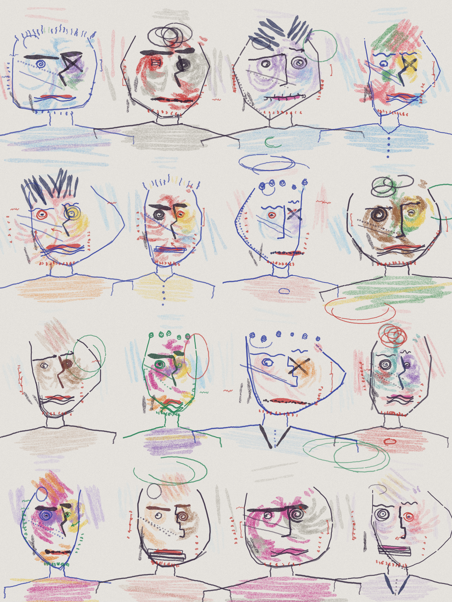
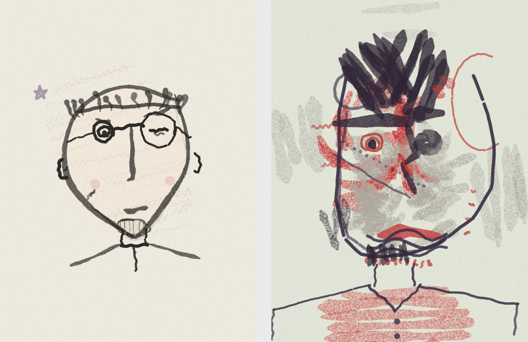
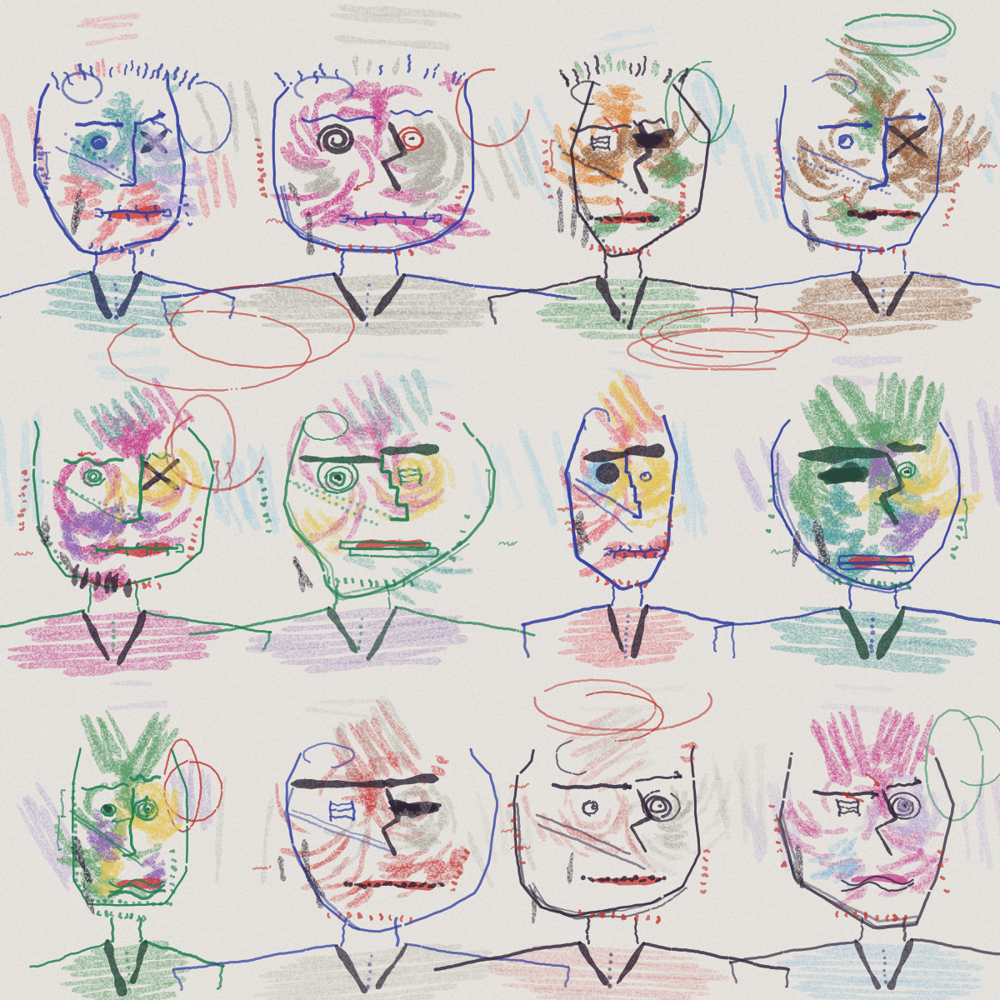

# doodleink

A procedural **hand-drawn face engine** for microcontrollers (and desktops).
No image assets: every character is code, rolled from a seed with trait
rarities and drawn stroke by stroke onto any framebuffer through a
two-method canvas interface. Portable header-only C++11, no heap, no
dependencies. Runs full speed on an ESP32.

It now speaks two languages.

**doodle** — naive ink portraits: a rough 3D head for pose, wobbly
pressure-tapered lines, ink crumbs on paper. Redraw at ~12 fps with a
fresh stroke seed and you get boiling-line animation for free.


**wild** — crayon-and-marker expressionism: color rides a flow field that
swirls around the eyes, features come from a glyph alphabet (spiral and
crossed-out eyes, staircase noses, zipper and morse mouths), and the
margins mutter with arrows, notes and measurement brackets. Every
portrait is a bust — tees, striped shirts, jackets, hoods and ponchos
enter from the page edge. Paper tint, face shape, garment, stroke
contrast and palette mood are all traits.



## One soul, many hands

The doodle style is the canonical identity: a seed's doodle face never
changes. Other skins receive a `SoulCore` extracted from that canonical
roll (energy, warmth, hairstyle and its ink, skull shape, garment, the
special eye, beardedness, vibe) and interpret it in their own language —
a mohawk becomes a crayon crest, a buzz cut becomes pen grass, a hoodie
stays a hoodie, a square skull stays square. Below, the same seed by
both hands — the spiky hair, the chin beard and the odd eye all carry
across:



The doodle style's vibes (punk, elder, desi...) carry across too — here
are punk souls interpreted by the wild hand:



```cpp
#include <doodleink.h>

// render any soul in any skin, by seed alone:
dd::DD_SKINS[k].paper(canvas, seed);
dd::DD_SKINS[k].draw(canvas, covBuf, seed, cx, cy, scale, frame, speed);
```

## How it works

| file | role |
|---|---|
| `dd_core.h` | math, mulberry32 RNG, Chaikin smoothing, fast trig/sqrt for MCUs |
| `dd_ink.h` | the media: pressure-tapered strokes, pen-lift fine-liner, hatch/scribble/stipple fills, dry-media paper-tooth grain — stamped into a max-coverage buffer, composited once per stroke |
| `dd_face.h` | the doodle style: trait tables with rarities, 3D-anchored features, vibes and presentations |
| `dd_wild.h` | the wild style: flow-field color, glyph features, annotations |
| `dd_skin.h` | SoulCore extraction and the skin registry |

Full control when you want it (traits, pose, moods):

```cpp
dd::FaceTraits f;
dd::rollFace(f, seed);                  // identity: traits + rarities + pose
dd::applyMood(f, expr, moodSeed);       // animation: re-dress a copy
dd::drawFace(canvas, covBuf, f, cx, cy, scale, frame, speed);
```

Every doodle face gets a rarity score and tier (common → legendary), plus
a full trait card via `dd::traitName` / `dd::CAT_LABELS`.

## Desktop preview

`extras/preview/` renders PNGs and animated GIFs, no dependencies beyond
zlib — iterate on style without hardware:

```sh
cd extras/preview
clang++ -O2 -std=c++14 -I../../src preview.cpp -lz -o preview
./preview poster 12345 6 8 200 out.png    # doodle crowd
./preview wildposter 9001 4 4 320 w.png   # wild crowd
./preview skinpair 1669527627             # one soul, both skins
./preview wildtribe 2                     # punk souls, wild skin
./preview anim 4242 72 out.gif            # boiling doodle, device-size
./preview wildanim 7001 72 out.gif        # boiling wild portrait
./preview stick 42                        # exact 135x240 device test
```

`extras/tools/screenshot.py` captures pixel-perfect screenshots from a
device over USB serial.

## Notes for MCU use

- The stroke engine nests a few KB of stack buffers — on ESP32 Arduino,
  set `SET_LOOP_TASK_STACK_SIZE(24 * 1024)`.
- All trig/sqrt is polynomial approximation (`fsin`, `fastSqrt`); Xtensa
  has no hardware versions and the wobble engine calls them constantly.
- Implement `fb565()` on your canvas for integer blending (~2× faster).
- E-paper: blend into 8-bit grayscale and dither on push.

Live demo of the engine in WebAssembly (and a device with a soul):
[evandroguedes.github.io/doodlesoul](https://evandroguedes.github.io/doodlesoul/).
Board-by-board notes:
[doodlesoul's compatibility table](https://github.com/evandroguedes/doodlesoul#board-compatibility).

## Credits

- The doodle style is inspired by [Mannay](https://x.com/mannay)'s
  canvas-2D crowd doodles — "every feature is a function", and the
  rough-3D-head trick for pinning features on turned faces.
- Stroke texture techniques (multi-octave wobble, taper envelopes, ink
  crumbs, pen-lift tremor) ported from
  [cyber-crowd](https://github.com/kengocodes/cyber-crowd) (MIT, © Kevin).

MIT.
