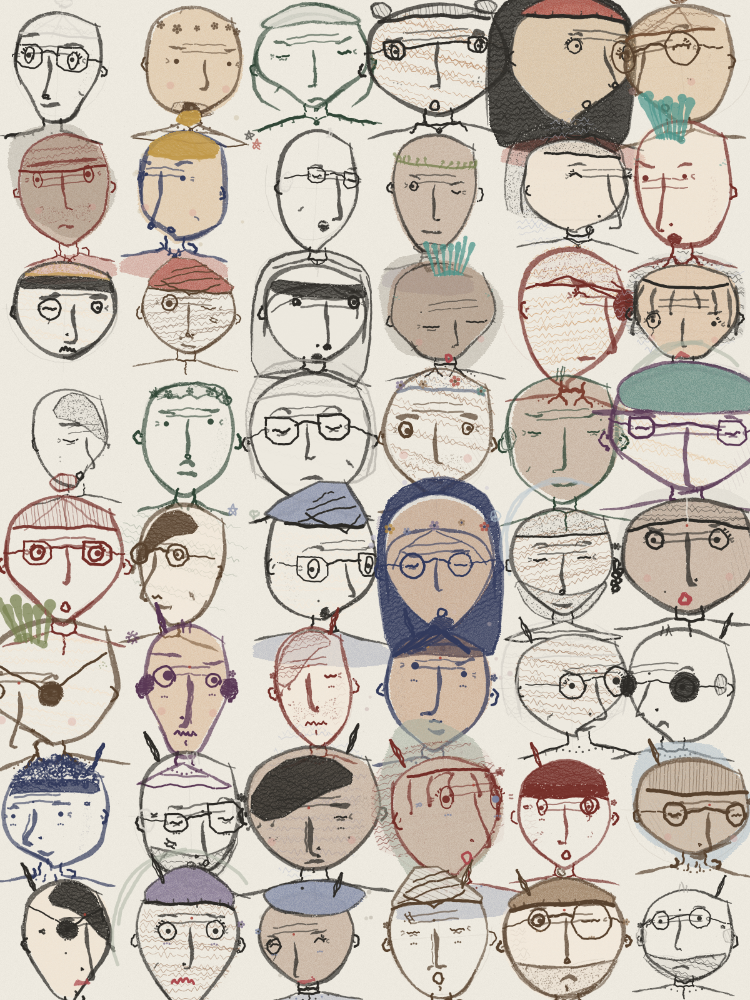

# doodleink

A procedural **hand-drawn face engine** for microcontrollers (and desktops).
No image assets: every character is code. A seed rolls a trait sheet with
rarities (skull, eyes, nose, hair, vibe...), a rough 3D head places the
features under yaw/pitch/roll, and a wobbly ink renderer draws pressure-
tapered strokes, ink crumbs, and paper texture onto any framebuffer.



Runs full-speed on an ESP32 (an M5StickC Plus animates at ~12 fps — redraw
with a fresh stroke seed each frame and you get boiling-line animation for
free). Portable header-only C++11, no heap, no dependencies.

## Use

```cpp
#include <doodleink.h>

// 1. Give it a framebuffer via a tiny interface:
struct MyCanvas : dd::Canvas {
  int width() const override { return 135; }
  int height() const override { return 240; }
  void blend(int x, int y, const uint8_t rgb[3], float a) override { /* ... */ }
  uint16_t* fb565() override { return myBuffer; }  // optional integer fast path
};

// 2. Roll a character and draw it:
dd::FaceTraits f;
dd::rollFace(f, seed);                            // traits + rarities + pose
dd::paperBackground(canvas, seed);
dd::drawFace(canvas, covBuf, f, cx, cy, scale);   // covBuf: w*h scratch bytes

// 3. Animate (optional): mutate pose/mood on a copy, redraw ~10 fps
dd::FaceTraits live = f;
dd::applyMood(live, expr, moodSeed);
live.turn = yaw; live.pitch = pitch;
dd::drawFace(canvas, covBuf, live, cx, cy, scale, frame % 3, /*speed=*/1);
```

Every face gets a rarity score and tier (common → legendary), plus a full
trait card (`dd::traitName`, `dd::CAT_LABELS`). The crowd is deliberately
everyone: two presentations, nine vibes (nerd, punk, emo, hippie, elder,
desi, rasta, folk...), eight skin tones, forty-odd hair/headwear styles.

## Desktop preview

`extras/preview/` renders PNG crowd posters, per-vibe sheets, device-size
tests, and animated GIF simulations — iterate on style without hardware:

```sh
cd extras/preview
clang++ -O2 -std=c++14 -I../../src preview.cpp -lz -o preview
./preview poster 12345 6 8 200 out.png
./preview anim 4242 72 out.gif
```

`extras/tools/screenshot.py` captures pixel-perfect screenshots from a
device over USB serial (the firmware side is ~15 lines; see any consumer
project).

## Notes for MCU use

- The stroke engine nests a few KB of stack buffers — on ESP32 Arduino,
  set `SET_LOOP_TASK_STACK_SIZE(24 * 1024)`.
- All trig/sqrt is fast polynomial approximation (`fsin`, `fastSqrt`) —
  Xtensa has no hardware versions and the wobble engine calls them a lot.
- Implement `fb565()` on your canvas for integer blending (~2× faster).
- E-paper: blend into 8-bit grayscale and dither on push; the ink-on-paper
  look was made for it.

## Credits

- Inspired by [Mannay](https://x.com/mannay)'s canvas-2D crowd doodles —
  "every feature is a function", and the rough-3D-head trick for pinning
  features on turned faces.
- Stroke texture techniques (multi-octave wobble, taper envelopes, ink
  crumbs, paper bites, pen-lift tremor) ported from
  [cyber-crowd](https://github.com/kengocodes/cyber-crowd) (MIT, © Kevin).

MIT.
